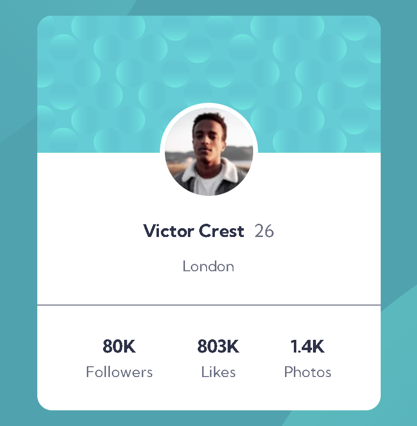

# Frontend Mentor - Profile card component solution

This is a solution to the [Profile card component challenge on Frontend Mentor](https://www.frontendmentor.io/challenges/profile-card-component-cfArpWshJ). Frontend Mentor challenges help you improve your coding skills by building realistic projects. 

## Table of contents

- [Overview](#overview)
  - [The challenge](#the-challenge)
  - [Screenshot](#screenshot)
  - [Built with](#built-with)
  - [My Solution](#solution)
- [Author](#author)

## Overview

### The challenge

Users should be able to:

- Build out the project to the designs provided

### Screenshot

### Built with

- CSS 
- Flexbox
- CSS Custom Properties

### Solution

- Solution URL: [My solution]()

## Author

- Frontend Mentor - [@whyleviathan](https://www.frontendmentor.io/profile/whyleviathan)
